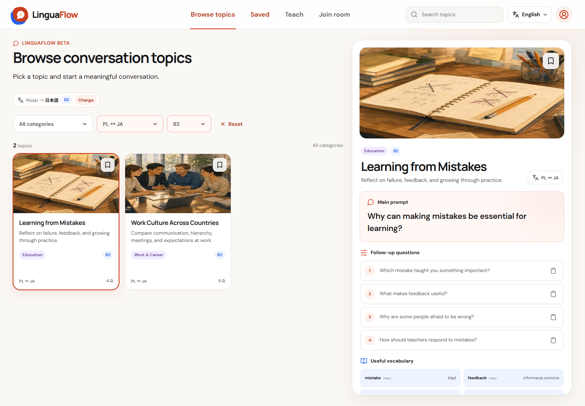
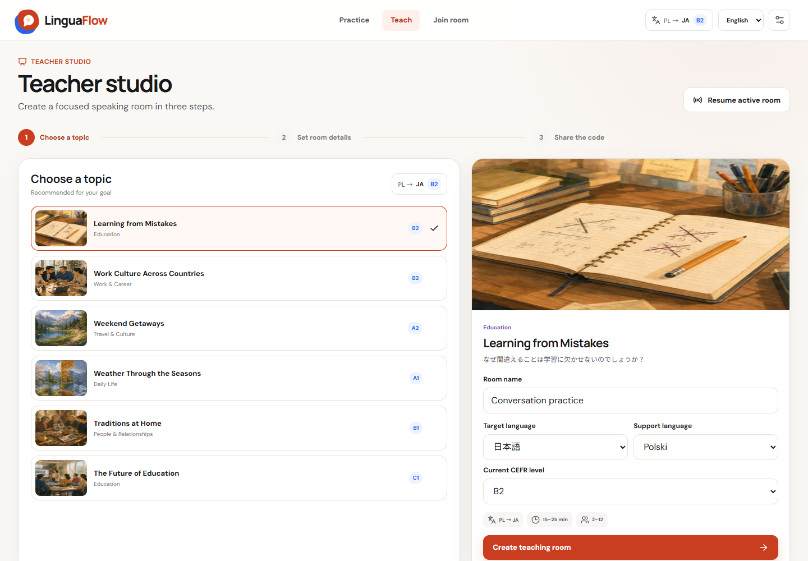
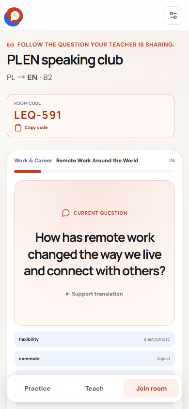
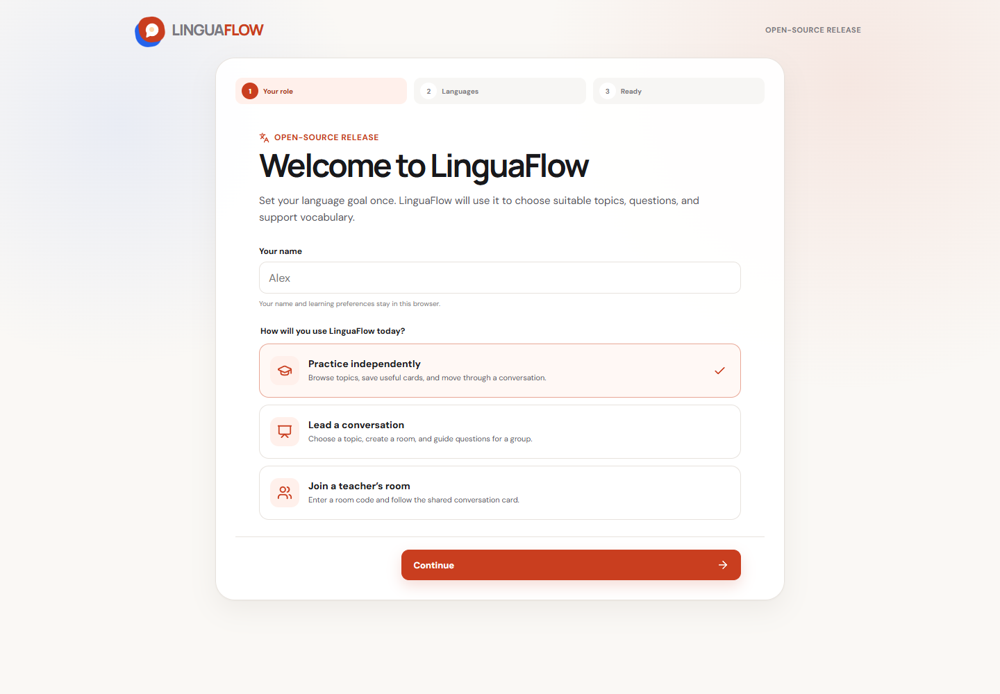
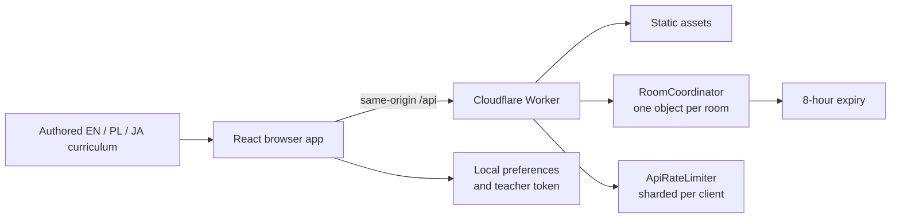

<div align="center">


# LinguaFlow

**Conversation prompts that help people start talking—and keep talking.**

Open-source, level-aware speaking practice for English, Polish, and Japanese
learners, teachers, and classrooms.

[](https://github.com/RobTar97/linguaflow/actions/workflows/ci.yml)
[](LICENSE)
[](docs/CONTENT_GUIDE.md)
[](#language-coverage)
[](docs/DEPLOYMENT.md)

[Quick start](#quick-start) · [How it works](#how-it-works) ·
[Teaching](docs/TEACHER_GUIDE.md) · [Contributing](CONTRIBUTING.md) ·
[Deploy](docs/DEPLOYMENT.md) · [Security](SECURITY.md)

</div>

## Why LinguaFlow?

Speaking practice often stalls before the first sentence. Learners need a useful
question, teachers need material they can trust, and multilingual groups need
translation support that does not take over the conversation.

LinguaFlow turns an interface language, support language, target language, and
CEFR level into a focused speaking workspace:

- **Learners** browse, search, save, and practise topics independently.
- **Teachers** select a topic, create a live room, and guide the active question.
- **Students** join from another device with a short code—no account required.

There is no AI answer generation, advertising, tracking SDK, external font
request, or paid API dependency. The curriculum is human-authored and reviewable
as TypeScript.

## What is included

| | Current public library |
|---|---:|
| Conversation topics | **36** |
| Main + follow-up questions | **228** |
| Translated vocabulary entries | **543** |
| Language pairs | **3** |
| CEFR levels | **A1–C1** |
| Interface languages | **English, Polish, Japanese** |

Each topic includes a central prompt, five or six follow-up questions, useful
vocabulary, category and level metadata, multilingual copy, and original
artwork. Search covers titles, descriptions, prompts, questions, and vocabulary
in all three languages.



## How it works

| Role | Flow |
|---|---|
| Learner | Choose a learning goal → browse or search → open a topic → follow the guided questions |
| Teacher | Choose a level and language pair → select a topic → create a room → share its code → advance the discussion |
| Student | Open LinguaFlow on any device → enter a display name and room code → follow the synchronized question |





### Language choices are intentionally separate

- **Interface language** controls navigation and instructions.
- **Support language** provides translations and explanations.
- **Target language** is the language participants are encouraged to speak.
- **CEFR level** controls the expected complexity.

Support and target languages cannot be identical. The setup flow explains each
choice before saving it.



## Language coverage

| Pair | Topics | Guided questions | Typical uses |
|---|---:|---:|---|
| English ↔ Polish | 12 | 76 | independent practice, tutoring, mixed-language groups |
| English ↔ Japanese | 12 | 76 | conversation classes, exchange sessions, self-study |
| Polish ↔ Japanese | 12 | 76 | direct practice without routing every explanation through English |

Topics span daily life, work and careers, travel and culture, relationships,
technology, health, education, and the environment.

## Quick start

Requirements: Node.js 22+ and npm 10+.

```bash
git clone https://github.com/RobTar97/linguaflow.git
cd linguaflow
npm install
npm run dev
```

Open the URL printed by Vite. Development mode uses a browser-local room
adapter, so curriculum and UI work does not require a Cloudflare account.

Run the complete release gate:

```bash
npm run check
```

To exercise the real Worker, rate limiter, and Durable Objects locally:

```bash
npm run preview:cloudflare
```

## Deploy to Cloudflare

LinguaFlow deploys as one Cloudflare Worker with static assets and two
SQLite-backed Durable Object classes. It requires no application secret,
external database, or client-side environment variable.

```bash
npm install
npx wrangler login
npm run deploy
```

For automated deployment, add `CLOUDFLARE_API_TOKEN` and
`CLOUDFLARE_ACCOUNT_ID` as encrypted GitHub Actions secrets—never as source
files, workflow literals, `VITE_*` variables, or repository variables. Follow
the [complete deployment and rollback guide](docs/DEPLOYMENT.md).

## Architecture



The browser never receives Cloudflare credentials. Room reads are protected by
an unguessable short access code; teacher mutations additionally require a
browser-held random token. Mutating requests are same-origin only and pass
strict schema, size, and rate checks. See the
[architecture](docs/ARCHITECTURE.md) and
[security model](docs/SECURITY_MODEL.md).

## Security and privacy by default

- no secrets are committed or compiled into browser assets;
- no external API keys are required by the application;
- common credential patterns are rejected by `npm run audit:secrets`;
- GitHub Actions dependencies are pinned to immutable commit SHAs;
- API mutations require a matching origin;
- payloads, names, status values, and question indexes are validated;
- request bodies are capped at 32 KB and abusive clients are rate-limited;
- rooms expire after eight hours and can be ended immediately;
- CSP, framing, MIME-sniffing, referrer, and permissions headers ship by default;
- no audio, video, transcript, email address, password, analytics cookie, or
  precise location is collected.

Room codes are classroom access codes, not identity authentication. Use first
names, initials, or classroom nicknames—never sensitive learner records. Read
[SECURITY.md](SECURITY.md) and [the privacy boundary](docs/PRIVACY.md) before
running an institutional deployment.

## Repository map

```text
src/
  catalog/       search, filtering, recommendations, validation
  content/       authored EN/PL/JA curriculum
  domain/        stable product types
  features/      setup, learner, teacher, and room experiences
  i18n/          workspace interface copy
  motion/        reusable accessible animation presets
  platform/      browser storage and room-service adapters
  styles/        tokens, layouts, states, responsive behavior
  ui/            shared presentational components
  workspace/     profile, role, route, saved-topic, and room state
worker/           same-origin API, room coordinator, rate limiter
scripts/          local release and security checks
docs/             product, architecture, content, role, and deployment guides
public/           metadata, headers, original artwork, social assets
```

Start with [the architecture guide](docs/ARCHITECTURE.md) for code changes or
[the content guide](docs/CONTENT_GUIDE.md) to add a conversation topic.

## Commands

| Command | Purpose |
|---|---|
| `npm run dev` | Start fast frontend development |
| `npm run test` | Run catalog and behavior tests |
| `npm run check:content` | Validate the complete topic library |
| `npm run audit:secrets` | Scan project text for common credential patterns |
| `npm run lint` | Run ESLint |
| `npm run build` | Type-check and create production assets |
| `npm run types:worker` | Type-check the Worker and Durable Objects |
| `npm run preview:cloudflare` | Run the complete production architecture locally |
| `npm run check` | Run every required release gate |
| `npm run deploy` | Check and deploy to Cloudflare Workers |

## Contributing

Code, accessibility fixes, teaching feedback, translations, new topics, and
documentation improvements are welcome.

1. Read [CONTRIBUTING.md](CONTRIBUTING.md).
2. Choose an issue form or propose a focused change.
3. Keep curriculum natural in English, Polish, and Japanese.
4. Run `npm run check`.
5. Open a pull request using the supplied checklist.

Community expectations are defined in the [Code of Conduct](CODE_OF_CONDUCT.md).
General help belongs in [support channels](SUPPORT.md). Security concerns should
use GitHub private vulnerability reporting, not a public issue.

## Project status

LinguaFlow is suitable for conversation practice, lesson preparation, workshops,
and small live classroom rooms. It does not yet provide user accounts,
institutional administration, permanent attendance, moderation tools, or
conversation recording. These boundaries are intentional and tracked in the
[roadmap](docs/ROADMAP.md).

## License and maintenance

Released under the [MIT License](LICENSE). Maintained by
[@RobTar97](https://github.com/RobTar97); ownership rules are recorded in
[`.github/CODEOWNERS`](.github/CODEOWNERS).
