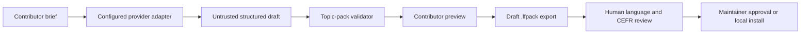

# Optional AI-assisted authoring and BYOK

**Status:** Proposed extension contract; not enabled in the default build.

LinguaFlow can make question authoring faster without turning generated text
into trusted curriculum. The recommended feature is an optional contributor
tool that creates a **draft topic**, validates it, and opens it in the existing
preview workspace. It is not an AI conversation partner and it never publishes,
installs, bundles, or marks content as reviewed automatically.

## Product flow

1. The contributor opens the public preview workspace and chooses **Draft with
   AI**.
2. They select target and support languages, CEFR level, category, audience,
   and a short topic brief.
3. They choose a configured provider connection and see where the request and
   credential will travel before continuing.
4. LinguaFlow requests structured topic data: title, description, main prompt,
   follow-ups, vocabulary, and facilitation suggestions.
5. The response is treated as untrusted input and passed through the same pack
   validator used for imported `.lfpack` archives.
6. The contributor reviews every locale, edits outside LinguaFlow if needed,
   adds authorship and license information, then exports a draft pack.
7. Human language and CEFR review remain separate factual assertions. Generation
   never creates a review assertion.



## Connection modes

### User-controlled direct endpoint — recommended first implementation

The browser sends the authoring request directly to an explicitly configured
HTTP(S) endpoint. This works well with a local or user-operated
OpenAI-compatible gateway and keeps LinguaFlow infrastructure out of the
credential path.

- The credential exists in React memory only and is cleared by refresh, tab
  close, provider change, or an explicit **Forget key** action.
- It is never written to `localStorage`, `sessionStorage`, IndexedDB, URLs,
  analytics, logs, learner exports, topic packs, service-worker caches, room
  state, or error reports.
- Production deployments use a build-time endpoint allowlist. The default
  hosted build has no remote provider origins enabled.
- The UI must explain that the chosen provider receives the brief and generated
  content and may charge the contributor's account.
- Arbitrary endpoints are a self-hosting option, not a default hosted-app
  capability, because broad `connect-src` weakens the Content Security Policy.

### Optional self-hosted relay

An operator may enable a same-origin relay when a provider does not support
browser requests. The relay is disabled by default and must:

- accept only allowlisted provider hosts and fixed API paths;
- reject redirects and private-network targets to prevent SSRF;
- apply origin checks, request-size limits, timeouts, and per-client rate limits;
- redact authorization headers and request bodies from logs and exceptions;
- never persist, retry, cache, or enqueue credentials or prompts;
- stream only bounded text/JSON responses and remove provider headers;
- publish its retention and infrastructure-log behavior.

A deployer-owned server credential is a different mode from BYOK and must be
labelled clearly. It requires quotas and abuse controls because the operator,
not the contributor, pays for requests.

## Provider interface

Provider-specific networking belongs behind one narrow adapter:

```ts
interface AuthoringProvider {
  id: string;
  label: string;
  connection: "direct" | "same-origin-relay";
  generateDraft(input: TopicDraftRequest, signal: AbortSignal): Promise<unknown>;
}
```

The provider returns `unknown`. Only the generation module knows provider
request and response shapes; only the pack validator can turn the result into a
previewable `PortableTopic`. No provider SDK should leak into feature,
workspace, room, learner-data, or catalog modules.

Model identifiers are deployment configuration, not hard-coded product facts.
The UI displays the exact provider, endpoint origin, and model before the
request. Contributors can cancel an in-flight request with `AbortController`.

## Generation disclosure

Generated drafts need provenance distinct from authorship and review:

```json
{
  "generation": {
    "provider": "configured-provider-id",
    "model": "operator-configured-model-id",
    "promptVersion": "topic-draft-v1",
    "generatedAt": "2026-08-12T00:00:00.000Z"
  }
}
```

Do not include prompts, credentials, provider request IDs, or hidden reasoning
in the pack. A person who selects, edits, and submits a draft is recorded as a
contributor; generation disclosure does not imply authorship or review.

## Data minimization

Authoring requests may contain only the fields visible in the draft form.
LinguaFlow must not attach learner profiles, private notes, vocabulary
bookmarks, saved topics, room participants, room codes, teacher tokens, or
usage history. Sensitive-topic warnings should be requested as curriculum
metadata, not inferred from learner information.

## Required implementation gates

- ADR approval for the first connection mode and CSP changes.
- Threat-model review for credential lifetime, XSS, SSRF, logging, and costs.
- A provider-neutral contract and mocked adapter tests; CI never calls a paid
  provider.
- Strict structured-output size limits and pack validation.
- Accessible credential, progress, cancellation, error, and review states.
- Explicit generation disclosure in preview, export, and public provenance.
- Documentation for provider data handling and self-host configuration.
- No change to the account-free, no-key core learner and teacher experience.

## Deliberate non-goals

- storing keys for convenience;
- sending learner conversations or notes to a model;
- automatically publishing generated topics;
- claiming generated language is reviewed or CEFR-calibrated;
- silently falling back to a project-paid provider;
- accepting arbitrary relay URLs on the hosted deployment;
- generating impersonations, personal data, or copyrighted passages on demand.
