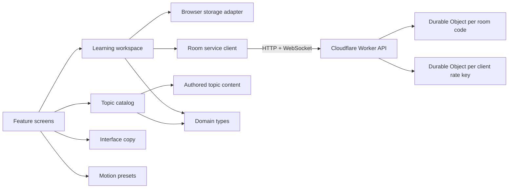

# Architecture

LinguaFlow is a client-side React application organized around product
boundaries rather than technical file types.

## Boundaries

### `domain`

Stable product language: topics, learning goals, profiles, roles, and rooms.
This layer must not import React or browser APIs.

### `content`

Human-authored multilingual curriculum data. Content is static TypeScript in
the first release so type errors are caught at build time and contributions remain easy
to review.

### `catalog`

The read API over content. It owns search, filtering, recommendations, and
validation. Feature code should not reimplement topic eligibility rules.

### `workspace`

The application state boundary. It owns profile setup, role routing, saved
topics, active-room state, and commands that change those values. The provider
is deliberately separate from context and contracts to preserve fast refresh
and keep imports directional.

### `platform`

Wrappers around environmental capabilities. Browser storage lives here so it
can later be replaced by server persistence without teaching every feature
about `localStorage`. The sound-effects service owns cue assets, volume, browser
playback, and the persisted mute preference so features only name an event.

### `features`

User-facing flows:

- `setup`: role and learning-goal onboarding;
- `explore`: learner browsing, details, saves, and independent sessions;
- `teacher`: topic selection and room creation;
- `rooms`: join and active teacher/student room experiences.

Features may consume domain types, catalog APIs, workspace commands, shared UI,
copy, and motion. They should not import content arrays directly.

## State model

The workspace stores three durable browser values:

- profile and learning goal;
- saved topic IDs;
- active room.

Development mode uses browser-local rooms for fast UI work. Production calls
the same-origin Worker API. Each room code maps to one SQLite-backed Durable
Object, which serializes joins and teacher updates and automatically expires
after eight hours. Teacher mutations require a browser-held secret token. See
ADR 0003. A hibernating WebSocket subscription broadcasts room snapshots;
visible tabs also perform an infrequent HTTP refresh so a temporary connection
failure cannot leave the classroom stale. See ADR 0004.

Self-paced practice links do not use room state. Their validated query
parameters identify the topic, support language, target language, and level;
each browser owns its own question index.

The Worker validates origin, content type, body size, room schema, participant
schema, and teacher authorization before state changes. A separate
`ApiRateLimiter` Durable Object class is sharded by a SHA-256-derived client key
and keeps independent read, write, and room-creation counters. This keeps abuse
control out of feature components and avoids a global singleton.

## Adding a backend

Keep feature contracts stable and replace implementations behind boundaries:

1. add authenticated profile and saved-topic repositories;
2. add authenticated participant identity across devices;
3. add institutional moderation and retention controls;
4. preserve the catalog as a pure read model unless content becomes remote.

## Architectural rules

- Imports point inward toward domain contracts.
- Features communicate through workspace commands, not shared mutable state.
- Content validation must remain runnable without a browser.
- Motion never carries business state.
- Sound never carries business state or essential feedback.
- UI localization and target-language content are separate concepts.
- Release limitations are described in docs and UI rather than hidden.
