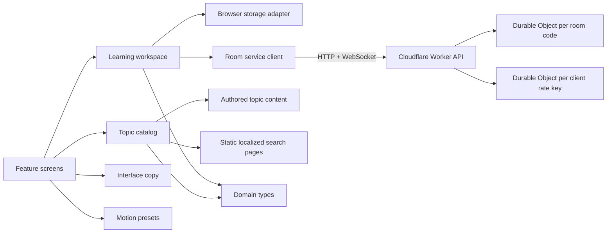

# Architecture

LinguaFlow combines a statically generated public curriculum site with a
client-side React workspace at `/app/`. Both are organized around product
boundaries rather than technical file types and are generated from the same
validated topic catalog.

## Boundaries

### `domain`

Stable product language: topics, learning goals, profiles, roles, and rooms.
This layer must not import React or browser APIs.

### `content`

Human-authored multilingual curriculum data. Content is static TypeScript in
the first release so type errors are caught at build time and contributions remain easy
to review.

### `catalog`

The read API over content. It owns search, filtering, recommendations, and
validation. Feature code should not reimplement topic eligibility rules. The
production build also reads this boundary to generate canonical language hubs,
topic resources, schema, sitemap, robots, and AI-discovery files without
duplicating curriculum data.

### `packs`

The portable curriculum Module. It owns the `.lfpack` archive adapter, manifest
schema, semantic validator, normalization into runtime topics, IndexedDB
repository interface, and dynamic catalog provider. One intake Module carries
an archive through validation and preview before it can cross the installation
seam. Feature code consumes the catalog and never parses ZIP or pack JSON
directly.

### `learnerData`

The Learner library Module. It owns the single browser record for saved Topics,
private Topic notes, and vocabulary bookmarks, including migration from the
three legacy records. Versioned export, deterministic merge, limits, and
validation use the same interface as workspace commands and tests.

### `workspace`

The application state boundary. It owns profile setup, role routing, saved
topics, active-room state, and commands that change those values. The provider
is deliberately separate from context and contracts to preserve fast refresh
and keep imports directional.

### `platform`

Adapters for environmental capabilities. Browser storage lives here so it can
later be replaced without teaching every feature about `localStorage`. Local
and Worker Room adapters satisfy one Room interface and run the same domain
rules. The sound-effects Module owns cue assets, volume, browser playback, and
the persisted mute preference so features only name an event.

### `features`

User-facing flows:

- `setup`: role and learning-goal onboarding;
- `explore`: learner browsing, details, saves, and independent sessions;
- `teacher`: topic selection and room creation;
- `rooms`: join, shared-question, and guided teacher/student room experiences.

Features may consume domain types, catalog APIs, workspace commands, shared UI,
copy, and motion. They should not import content arrays directly.

## State model

The workspace coordinates these durable browser values:

- profile and learning goal;
- active room.
- the Learner library as one versioned record;
- installed packs in the separate IndexedDB pack repository.

Development mode selects the browser-local Room adapter once for fast UI work.
Production selects the same-origin Worker adapter. Both use the same Room
construction, normalization, participant, and cursor rules. Each room code maps to one SQLite-backed Durable
Object, which serializes joins and teacher updates and automatically expires
after eight hours. Teacher mutations require a browser-held secret token. See
ADR 0003. A hibernating WebSocket subscription broadcasts room snapshots;
visible tabs also perform an infrequent HTTP refresh so a temporary connection
failure cannot leave the classroom stale. See ADR 0004.

Live rooms declare either `shared-question` or `guided-training`. Guided
training uses a versioned eight-step plan. Its lobby, pause bit, authored prompt
index, reflection, and completion state are encoded into the existing bounded
room cursor, so the same authorized update and broadcast path synchronizes the
whole lifecycle. Missing mode metadata is interpreted as the legacy shared
question format. See ADR 0005.

Self-paced practice links do not use room state. Their validated query
parameters identify the topic, support language, target language, and level;
each browser owns its own question index.

The Worker validates origin, content type, body size, room schema, participant
schema, and teacher authorization before state changes. A separate
`ApiRateLimiter` Durable Object class is sharded by a SHA-256-derived client key
and keeps independent read, write, and room-creation counters. This keeps abuse
control out of feature components and avoids a global singleton.

## Extension seams and stability

| Seam | Current contract | Expected evolution |
|---|---|---|
| Curriculum | Typed core topics plus schema-versioned `.lfpack` archives through the runtime catalog | Bundled approved packs and migrations for future schema majors |
| Localization | Compile-time EN/PL/JA domain and workspace copy | Locale registration only after fallback, layout, SEO, and review contracts exist |
| Room service | Feature-facing client with local and Worker behavior | Additional adapters may preserve authorization, expiry, errors, and synchronization |
| Learner data | Versioned, user-controlled preview-and-merge JSON import/export | Optional adapters may synchronize only with explicit consent |
| Public discovery | Build generated from the validated catalog | Pack-aware canonical pages without a duplicate content database |
| Deployment | Cloudflare Worker and Durable Objects | Other hosts may implement equivalent same-origin and temporary-state behavior |

These are extension seams, not stable third-party APIs. Before version 1.0,
internal TypeScript interfaces may change with migration notes. Shared external
formats must carry an explicit schema version, fixtures, compatibility tests,
and documented failure behavior.

Do not add arbitrary runtime plugin loading to create extensibility. Prefer
data formats for curriculum, adapters for environmental services, and normal
reviewed code for trusted UI behavior. See the
[open-platform guide](OPEN_PLATFORM.md).

## Adding a backend

Keep feature contracts stable and replace implementations behind boundaries:

1. add authenticated profile and saved-topic repositories;
2. add authenticated participant identity across devices;
3. add institutional moderation and retention controls;
4. preserve the catalog as a pure read model unless content becomes remote.

## Architectural rules

- Imports point inward toward domain contracts.
- Features communicate through workspace commands, not shared mutable state.
- Content validation must remain runnable without a browser.
- Motion never carries business state.
- Sound never carries business state or essential feedback.
- UI localization and target-language content are separate concepts.
- Release limitations are described in docs and UI rather than hidden.
