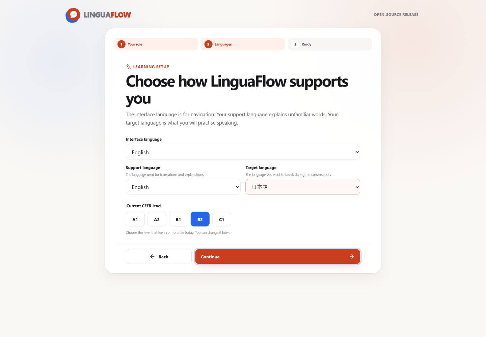
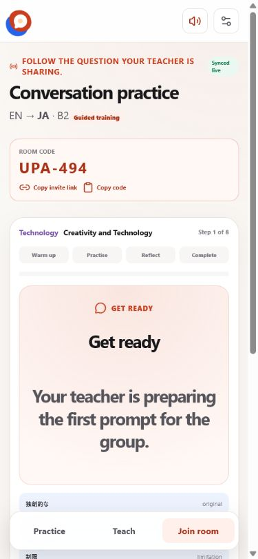

# Learner guide

## Independent practice

1. Choose **Practice independently** during setup.
2. Select the language used for help and the language you want to speak.
3. Choose your current CEFR level.
4. Browse recommended topics or change the filters.
5. Open a card to preview its prompt, follow-ups, and vocabulary.
6. Save useful topics or start a guided conversation.

During a guided conversation, answer aloud before moving on. Short pauses,
restarts, and mistakes are part of useful speaking practice.

### Opening a teacher’s practice link

A self-paced link opens the assigned topic with the teacher’s support language,
target language, and level already selected. You control **Next question**.
Your progress is private to that browser tab and does not move anyone else.

## Joining a teacher

Open the teacher’s invite link, enter your display name, and join. If links
cannot be opened, switch to **Join room** and type the short code instead. The
room displays the current target-language question and optional support
translation. In a live room, only the teacher controls the shared question.

### During guided training

The room begins in **Get ready** while the teacher checks the group. Once the
teacher starts, the phase row moves through warm-up, practice, reflection, and
completion. The step counter and progress bar are shared with everyone.

- Answer the target-language prompt before opening the support translation.
- Use the vocabulary cards as optional help, not a required word list.
- When the teacher pauses, the current prompt remains visible. Wait for the
  synchronized resume instead of reloading or leaving the room.
- At completion, the room remains available until the teacher restarts or ends
  it. Completion does not create a grade, attendance record, or permanent
  history.

If the live connection is temporarily unavailable, the status changes to
periodic synchronization and the visible tab continues refreshing. An ended or
expired room cannot be rejoined; ask the teacher for a new code.

On a Cloudflare deployment, rooms synchronize across devices. A room expires
after eight hours or when the teacher ends it. Use a first name, initial, or
classroom nickname rather than sensitive personal information.

## Choosing your languages

- Pick the language you understand best as **support language**.
- Pick the language you want to produce as **target language**.
- Pick whichever interface language makes navigation easiest.

These can be changed at any time from learning setup.
