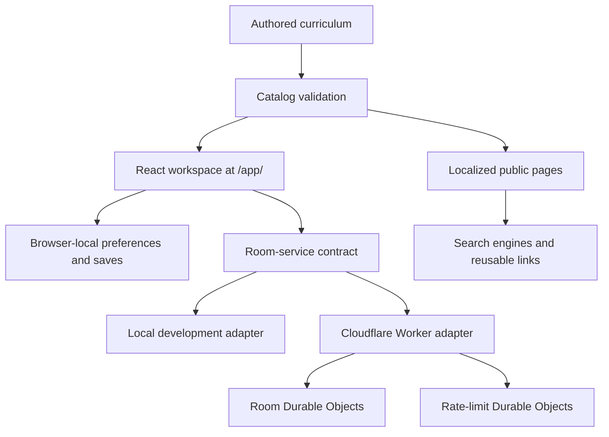

# Open-platform guide

**Status:** Implemented foundation with planned extension contracts.

LinguaFlow is an open-source conversation-practice platform, not only a single
hosted application. The current repository contains a complete learner and
teacher experience, a validated multilingual curriculum, static public topic
pages, and an optional real-time classroom backend. The platform direction is
to make those parts easier to review, replace, extend, and redistribute without
making contributors adopt a proprietary service.

## Table of contents

- [What the platform provides](#what-the-platform-provides)
- [How the parts work together](#how-the-parts-work-together)
- [Core platform objects](#core-platform-objects)
- [Current extension seams](#current-extension-seams)
- [Rules for an open extension contract](#rules-for-an-open-extension-contract)
- [Most useful next platform functions](#most-useful-next-platform-functions)
- [Proposing a platform function](#proposing-a-platform-function)

## What the platform provides

| Capability | Status | Public behavior |
|---|---|---|
| Multilingual topic library | Implemented | 48 authored topics across English, Polish, and Japanese |
| Level-aware discovery | Implemented | Search, filters, recommendations, saves, and CEFR A1–C1 |
| Independent practice | Implemented | Shareable practice links and learner-controlled question progress |
| Teacher Studio | Implemented | Topic, language direction, level, room name, and session-format setup |
| Live rooms | Implemented | Shared-question and eight-step guided sessions with synchronized state |
| Public curriculum website | Implemented | Static localized topic pages, sitemap, schema, and crawl controls |
| Self-hosting | Implemented | One Cloudflare Worker with static assets and two Durable Object classes |
| Topic-pack interchange | Implemented | Versioned `.lfpack` manifest, CLI/browser validation, preview, and local installation |
| Community review metadata | Implemented foundation | Authorship, license, source revision, and factual review assertions with explicit unreviewed state |
| Teacher facilitation | Implemented foundation | Baseline notes for all core topics and printable lesson sheets |
| Learner data portability | Implemented | Preview-then-merge JSON export/import without room history or tokens |
| Offline practice | Implemented | App shell, core content, installed packs, update prompt, and network-only live rooms |
| Optional identity and continuity | Exploring | User-controlled accounts and history without making accounts mandatory |

The default distribution deliberately has no advertising SDK, speech
recording, answer grading, external font request, paid API, or required user
account. A fork can change those choices, but it should document the new data
and safety boundary clearly.

## How the parts work together

The validated catalog is the shared source for discovery, classroom sessions,
and public search pages. This avoids maintaining a separate “SEO curriculum”
or allowing a backend to silently change authored questions.

## Core platform objects

| Object | Owns | Does not own |
|---|---|---|
| `Topic` | Stable ID, language pair, CEFR level, category, prompts, questions, vocabulary, artwork reference | Learner progress or classroom identity |
| `LearningGoal` | Support language, target language, level | Interface language or proficiency assessment |
| `WorkspaceProfile` | Display name, role, interface locale, learning goal | Password, email, school, or permanent account |
| `LearningRoom` | Topic, language direction, level, session mode, cursor, participants, expiry | Recording, grading, attendance, or transcripts |
| `GuidedTrainingPlan` | Versioned step count and session-mode contract | Topic text or private learner notes |

These domain types are the best starting point for understanding compatibility.
They are defined in `src/domain`; feature components should consume them rather
than inventing parallel shapes.

## Current extension seams

### Curriculum

Add or improve topics in `src/content`, then query them through
`topicCatalog`. Catalog validation checks IDs, language coverage, question and
vocabulary counts, level metadata, supported language pairs, and artwork
references. The [content guide](CONTENT_GUIDE.md) defines the human review
standard.

### Interface and localization

Workspace copy lives in `src/i18n`; curriculum copy remains with each topic.
English, Polish, and Japanese are currently a closed, compile-time set. Adding
a locale therefore requires an explicit domain, content, interface, SEO, and
layout change—not merely another translation JSON file.

### Experience foundations

Reusable UI belongs in `src/ui`, motion behavior in `src/motion`, sound
playback in `src/platform`, and visual tokens/layout in `src/styles`. New
features must remain understandable with sound muted and reduced motion
enabled.

### Room backends

Features call the `roomService` contract. Fast frontend development uses the
browser-local implementation; production uses same-origin HTTP and WebSocket
routes backed by Durable Objects. A future backend adapter should preserve room
authorization, bounded payloads, expiry, error semantics, and synchronization
behavior.

### Public discovery

The build reads the catalog to produce localized HTML, structured data,
sitemaps, social metadata, and `llms.txt`. A content extension is incomplete if
it appears only in the application but not in the generated public resource
set.

### Deployment

The default deployment target is Cloudflare, but the browser app has no direct
Cloudflare dependency. A different host needs equivalent static routing,
same-origin room APIs, WebSocket behavior, temporary state, security headers,
and real 404 handling.

## Rules for an open extension contract

1. **Keep the core useful without an account or paid service.** Optional
   integrations must degrade to a complete local/self-hosted experience.
2. **Prefer portable data over hidden state.** New persistent features should
   define export, import, versioning, and deletion behavior.
3. **Version shared formats.** Topic packs, room plans, and future learner-data
   exports need explicit schema versions and migration rules.
4. **Preserve human review.** Generated drafts may assist contributors, but
   curriculum, translations, and level claims need accountable review. The
   proposed [AI authoring boundary](AI_AUTHORING.md) keeps generation optional,
   draft-first, provider-neutral, and outside the learner-data path.
5. **Do not turn extensions into surveillance.** State the minimum data,
   retention, threat model, and user controls before implementation.
6. **Keep accessibility in the contract.** Keyboard use, localization,
   reduced motion, muted audio, and responsive layouts are acceptance criteria.
7. **Document compatibility.** A contributor should know which core version,
   locale set, and schema version an extension supports.

## Most useful next platform functions

The following functions offer high community value while reinforcing the
existing architecture.

### 1. Versioned topic packs and validator — Implemented

Define a portable JSON format containing pack metadata, topic records, locale
coverage, artwork references, license, attribution, and schema version. Provide
a command that validates a pack and prints actionable errors before import.

Why first: this turns curriculum contributions and independent community packs
into a supported workflow without requiring contributors to understand the
entire application.

### 2. Contributor preview workspace — Implemented foundation

Add a local preview that loads one proposed topic or pack, displays every
locale and breakpoint, and reports content, layout, CEFR, accessibility, and
missing-attribution checks.

Why: review quality improves when language contributors can see the real card,
session, and public page before opening a pull request.

### 3. Review and provenance metadata — Implemented foundation

Represent author, source license, last meaningful review, language-review
status, CEFR-review status, and revision notes without claiming credentials the
project cannot verify.

Why: a growing open curriculum needs transparent trust signals and clear work
queues more than it needs a larger raw topic count.

### 4. Teacher facilitation layers — Implemented foundation

Allow optional timing, warm-up, grouping pattern, sensitive-topic note,
adaptation prompts, and learning objective metadata. Keep the learner-facing
topic portable and avoid embedding institution-specific lesson plans in core
questions.

Why: teachers can reuse the same topic in tutoring, classrooms, clubs, and
language exchanges while community members contribute pedagogical expertise.

### 5. Portable learner-owned data — Implemented

Export and import saved topics, preferences, vocabulary selections, and private
reflection notes as a versioned file. The user chooses where it lives; the
default project does not receive it.

Why: continuity becomes useful across devices and self-hosted instances without
making centralized accounts the first solution.

### 6. Print, offline, and low-connectivity modes — Implemented foundation

Create accessible printable lesson sheets and installable/offline topic access.
Live synchronization can remain online-only while authored prompts and
vocabulary stay available during connectivity problems.

Why: open educational software should work in more classrooms than those with
reliable individual devices.

### 7. Deployment diagnostics — Planned

Add a self-hosting doctor command that checks Node version, public origin,
Worker configuration, headers, asset paths, Durable Object bindings, and smoke
URLs, then returns fixes without exposing credentials.

Why: reducing deployment support work makes forks more sustainable and gives
new maintainers confidence.

### 8. Federated catalog discovery — Exploring

Let deployments subscribe to explicitly trusted pack indexes and show license,
review, compatibility, and origin before installation. No automatic remote
code execution and no silent curriculum replacement.

Why later: federation is valuable only after the pack schema, validator,
provenance model, and update policy are stable.

### 9. Optional identity adapters — Exploring

Define an adapter boundary for account-backed saves or teacher ownership while
retaining anonymous practice and classroom joins. Institutional identity,
consent, deletion, recovery, and child-safety requirements need a separate ADR
and threat model.

Why later: identity can improve continuity but would materially expand the
privacy and moderation surface.

### 10. Optional AI-assisted authoring — Proposed

Offer contributor-controlled generation of topic drafts behind a small provider
adapter. Generated output remains untrusted until it passes the ordinary pack
validator, contributor preview, provenance disclosure, and human review. The
default build has no configured provider and no required paid service. See the
[AI authoring proposal](AI_AUTHORING.md) and
[ADR 0006](adr/0006-ai-authoring-is-optional-and-draft-first.md).

## Proposing a platform function

A substantial proposal should include:

1. the learner, teacher, contributor, or operator problem;
2. evidence or a concrete scenario;
3. the smallest useful version;
4. affected domain types and extension seams;
5. accessibility and localization behavior;
6. data collected, retained, exported, and deleted;
7. compatibility and migration needs;
8. alternatives, including doing nothing;
9. tests and documentation required for acceptance.

Open a feature proposal before implementation when a change creates a new
shared format, service dependency, trust boundary, or long-lived state. The
[governance process](../GOVERNANCE.md) explains how proposals move from
exploration to an accepted roadmap item.

## Stability note

LinguaFlow does not yet publish a versioned JavaScript SDK or promise a stable
third-party HTTP API. Domain types and internal contracts can evolve before
version 1.0, but changes should include migration notes and preserve existing
room and content behavior when practical. The first intended public extension
contract is the planned topic-pack format, not arbitrary runtime plugins.
