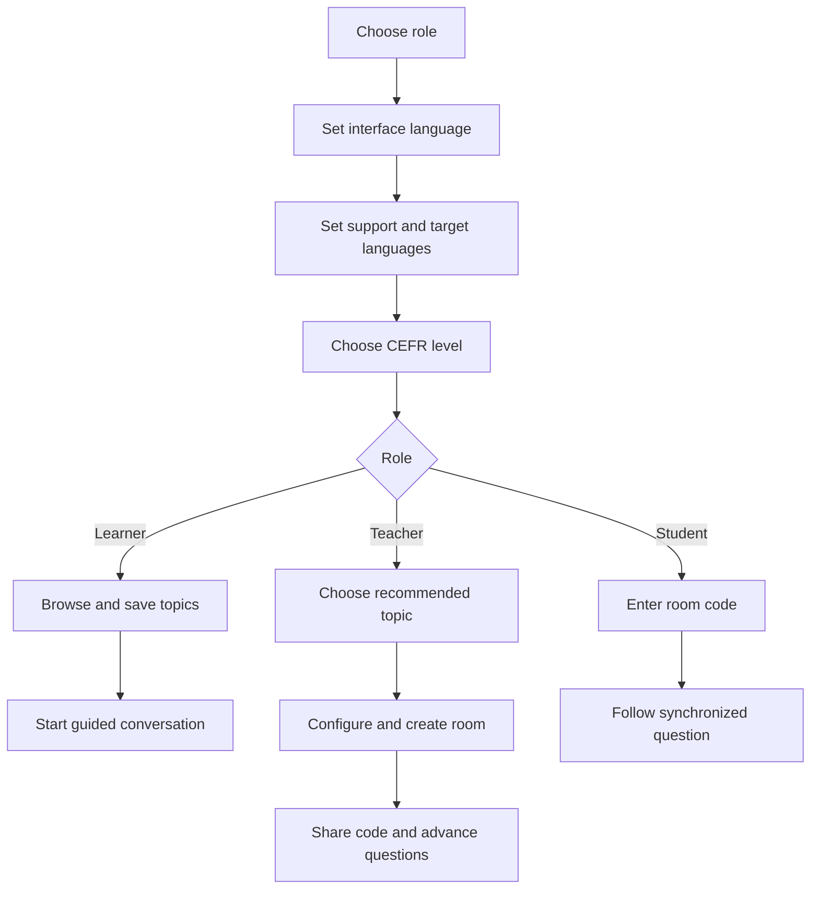

# Product guide

## Product promise

LinguaFlow helps people begin and sustain useful language conversations. It
does not attempt to grade speech, replace a teacher, or simulate a social
network in the first public release.

## Primary jobs

### Learner

“Help me find something appropriate to talk about and give me enough support
to keep speaking.”

### Teacher

“Help me prepare and lead a level-appropriate speaking activity without
building a worksheet from scratch.”

### Student in a room

“Show me the same current prompt as the group and let me reveal support only
when I need it.”

## Canonical journey

## Language decisions

The interface asks for three distinct values because combining them causes
frequent ambiguity:

- A Polish speaker learning Japanese may still prefer an English interface.
- A teacher may present a Japanese prompt while showing Polish support.
- The language pair determines topic eligibility, while direction determines
  which prompt is primary.

## Content principles

- Prompts invite experience and perspective, not factual trivia.
- Difficulty comes from language demands, not obscure subject knowledge.
- Follow-ups progress from concrete to reflective.
- Vocabulary is useful during the conversation, not merely related to it.
- Topics avoid requiring disclosure of trauma, health status, finances, or
  other sensitive personal information.

## Success signals

Future product analytics should prioritize:

- a learner starts a conversation after choosing a topic;
- a session reaches at least the third prompt;
- a teacher creates a room without leaving the flow;
- students can join without help beyond the code;
- saved topics are revisited;
- users can correctly explain support vs target language.

## Current non-goals

- automated proficiency grading;
- public learner profiles or matching;
- production classroom records;
- AI-generated answers;
- payments or institutional administration.
