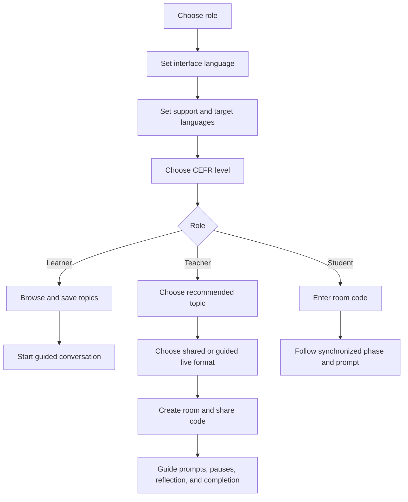

# Product guide

## Product promise

LinguaFlow helps people begin and sustain useful language conversations. It
does not attempt to grade speech, replace a teacher, or simulate a social
network in the first public release.

## Primary jobs

### Learner

“Help me find something appropriate to talk about and give me enough support
to keep speaking.”

### Teacher

“Help me prepare and lead a level-appropriate speaking activity without
building a worksheet from scratch.”

### Student in a room

“Show me the same current prompt as the group and let me reveal support only
when I need it.”

## Canonical journey

## Language decisions

The interface asks for three distinct values because combining them causes
frequent ambiguity:

- A Polish speaker learning Japanese may still prefer an English interface.
- A teacher may present a Japanese prompt while showing Polish support.
- The language pair determines topic eligibility, while direction determines
  which prompt is primary.

## Content principles

- Prompts invite experience and perspective, not factual trivia.
- Difficulty comes from language demands, not obscure subject knowledge.
- Follow-ups progress from concrete to reflective.
- Vocabulary is useful during the conversation, not merely related to it.
- Topics avoid requiring disclosure of trauma, health status, finances, or
  other sensitive personal information.

## Capability model

LinguaFlow has four connected product surfaces:

| Surface | Primary user | Current responsibility |
|---|---|---|
| Public curriculum | Learners, teachers, search visitors | Explain the project and expose stable localized topic resources |
| Practice workspace | Independent learners | Discover topics, save useful material, and follow self-paced prompts |
| Teaching workspace | Teachers and students | Prepare, share, synchronize, pause, reflect, complete, and end a room |
| Open platform | Contributors and self-hosters | Review curriculum, extend documented seams, validate releases, and operate a fork |

The same catalog supplies all four surfaces. A new capability should not create
an unrelated content store, duplicate language logic, or make the public
curriculum disagree with the application.

## Success signals

Future product analytics should prioritize:

- a learner starts a conversation after choosing a topic;
- a session reaches at least the third prompt;
- a teacher creates a room without leaving the flow;
- students can join without help beyond the code;
- a guided room reaches reflection and completion without losing synchronization;
- saved topics are revisited;
- users can correctly explain support vs target language.

Open-platform success also means:

- a first-time contributor can find the right guide and validation command;
- a language reviewer can assess one topic without understanding room code;
- a self-hoster can identify a configuration problem without exposing secrets;
- community curriculum carries portable license, attribution, review, and
  compatibility information;
- learner-owned data can move without requiring an upstream account.

## Evaluating future functions

Prefer a function when it improves conversation, teaching, contribution, or
self-hosting; fits an existing boundary; has an accessible and localized
experience; and defines portable data and deletion behavior. Require stronger
evidence when it adds identity, recording, grading, moderation, permanent
history, remote code, or a paid dependency.

The [open-platform guide](OPEN_PLATFORM.md) contains the full proposal template
and the [community vision](VISION.md) records the strategic decision filters.

## Current non-goals

- automated proficiency grading;
- public learner profiles or matching;
- production classroom records;
- AI-generated answers;
- payments or institutional administration.
