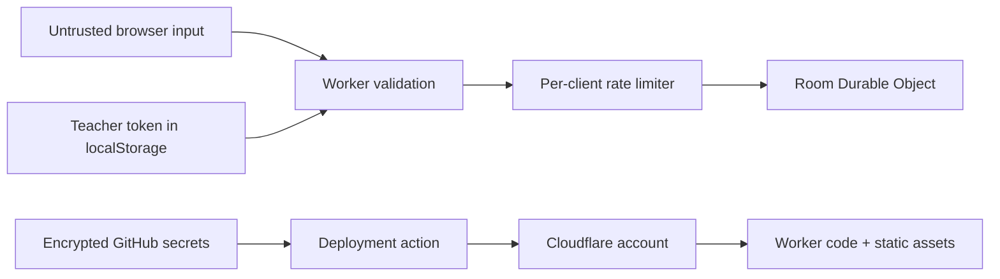

# Security model

This document describes the security properties of the reference LinguaFlow
deployment. It is not a substitute for an institution’s own risk assessment.

## Protected assets

- teacher control of the active question and room deletion;
- room and participant display names during the eight-hour room lifetime;
- Cloudflare deployment credentials;
- contributor and release integrity;
- browser-stored learning preferences and teacher control tokens.

LinguaFlow deliberately does not store passwords, email addresses, recordings,
transcripts, grades, payment data, or permanent attendance.

## Trust boundaries



Everything received from a browser is untrusted. The Worker—not React
components—enforces authorization, allowed values, lengths, content type,
request size, origin, and rate limits.

## Controls

### Credentials and build output

- The application has no client-side API keys.
- The default application has no AI provider. The proposed optional BYOK
  authoring flow keeps a contributor-entered key in memory for the active page
  only; it must not enter storage, URLs, logs, exports, room state, or caches.
- Cloudflare credentials exist only in encrypted GitHub Actions secrets or the
  deployer’s authenticated Wrangler session.
- Variables prefixed with `VITE_` are treated as public build-time values and
  must never contain credentials.
- `npm run audit:secrets` rejects common credential formats before other release
  checks run.
- Public GitHub repositories receive GitHub secret scanning; user push
  protection provides another pre-push control.
- Workflow dependencies are pinned to full commit SHAs.
- The lockfile overrides Wrangler’s transitive image dependency to a patched
  release; `npm audit --audit-level=high` is part of release verification.

### Room access

- Room codes use cryptographically secure randomness and exclude ambiguous
  letters.
- Knowing a room code permits reading its current classroom state and joining
  with a display name. A code is therefore a temporary access code, not an
  identity credential.
- Teacher actions require a separate UUID token held only by the creating
  browser. The token is sent in an `Authorization` header and is never returned
  in room responses.
- Participant removal requires a separate browser-held UUID token created when
  joining. Public participant IDs alone cannot remove someone from a room.
- Tokens and room references are removed from the browser when a teacher ends a
  room.

### Request handling

- Mutation requests must have an `Origin` equal to the deployment origin.
- WebSocket upgrades require `GET`, an upgrade header, and the same deployment
  origin before they reach a room object.
- JSON is required for mutation bodies other than `DELETE`.
- Bodies are limited to 64 KB even when `Content-Length` is absent. Imported
  room topics are additionally limited to a 32 KB content-only snapshot.
- Imported topic snapshots are reconstructed from allowlisted fields and must
  match their namespaced pack ID, supported locales, bounded curriculum shape,
  license, authorship, and pack version before room storage.
- Room codes, language codes, CEFR levels, names, participant status, topic IDs,
  dates, and question indexes are validated.
- Display names and room names are trimmed before storage.
- Reads, writes, and room creation have separate one-minute rate buckets.
- Client addresses are SHA-256-derived before selecting a rate-limit object; raw
  addresses are not written to application storage.
- Unexpected backend failures return a generic `503` message rather than
  internal details.

### Browser and asset policy

The supplied headers restrict scripts, network connections, fonts, images,
forms, framing, referrers, device permissions, and MIME interpretation. The
frontend is self-contained and makes no browser request to an analytics,
advertising, font, or AI provider.

Self-paced URLs contain only a topic ID, language direction, and level. Live
invite URLs contain only the temporary room code. Neither URL includes a
teacher token, learner identity, answer, or transcript.

## Retention

Room state is deleted when the teacher ends the room or eight hours after room
creation. Rate-limit counters expire after approximately one minute. Browser
preferences remain until the user resets site data.

## Known limitations

- Anyone who obtains a live room code can view the room and join it.
- Display names are not verified identities.
- `localStorage` is readable by JavaScript running on the same origin; preserving
  a strict content-security policy and dependency hygiene is essential.
- Rate limiting is an abuse-reduction control, not a complete denial-of-service
  defense.
- The reference app has no teacher account recovery. Losing the creating
  browser’s token means losing teacher control of that room.
- Deployers remain responsible for Cloudflare account security, custom domains,
  legal notices, institutional policy, and incident response.

## Verification

Before release:

```bash
npm ci
npm run check
npm audit --audit-level=high
npx wrangler deploy --dry-run
```

After deployment, complete the two-browser smoke test in
[`DEPLOYMENT.md`](DEPLOYMENT.md), inspect response headers, and verify that no
credential or unexpected third-party request appears in browser developer
tools.

Any self-hosted AI authoring integration changes the network and credential
boundary and must follow [AI_AUTHORING.md](AI_AUTHORING.md), update CSP, and
publish its provider and data-use notice before it is enabled.
