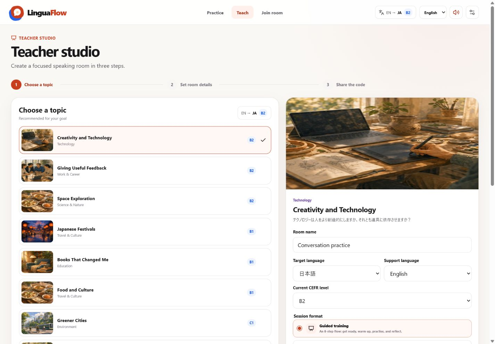
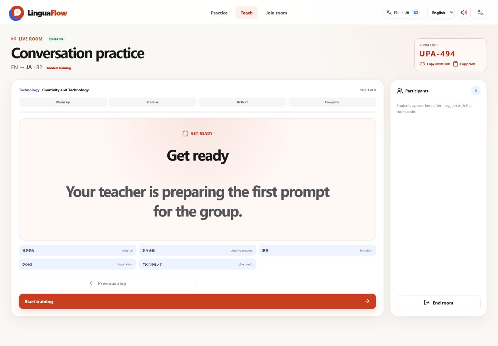

# Teacher guide

LinguaFlow supports self-paced assignments and two live-room formats. Choose
the path before sharing anything so learners know who controls the pace and
whether the room follows a structured sequence.

## Send self-paced practice

1. Complete setup as **Teacher**.
2. Choose the support language, target language, and CEFR level.
3. Select a topic and review its target-language questions.
4. Choose **Copy practice link**.
5. Send the link through your normal classroom channel.

The link contains only the topic ID, language direction, and level. It does not
create a room or identify the learner. Every learner starts at question one and
advances independently. Changing one learner’s question never changes another
learner’s session.

Use this path for homework, asynchronous preparation, station work, or a
learner who needs extra rehearsal time.

## Prepare a live room

1. Complete setup as **Teacher**.
2. Confirm the support language, target language, and CEFR level in the header.
3. Choose a recommended topic.
4. Set a clear room name.
5. Confirm which topic language is the target. The other becomes support.
6. Choose **Guided training** or **Shared question**.
7. Create the room and share **Copy invite link**. The short code remains
   available as a fallback.

The topic preview updates to the selected target language so the primary prompt
is visible before the room starts.

### Choose a live format

- **Guided training** is the default for a complete activity. Its eight
  synchronized steps are lobby, warm-up, four practice prompts, reflection,
  and completion. The teacher starts, pauses, resumes, moves backward or
  forward, finishes, and may restart the sequence.
- **Shared question** preserves the original lightweight room. The teacher
  moves through one synchronized question at a time without lobby, pause, or
  completion phases.

Use guided training when a group benefits from visible pacing and a clear
ending. Use shared question for drop-in conversation, tutoring, or when the
teacher wants to improvise timing around one prompt.

## Lead the conversation

- Introduce the topic without pre-teaching every answer.
- Give learners quiet thinking time before the first response.
- In guided training, keep the room in the lobby until everyone can see the
  same topic and language direction, then choose **Start training**.
- Use **Pause session** for thinking time, instructions, or a regroup. Pausing
  keeps the current prompt visible and synchronized.
- Use **Next step** when the current prompt has produced enough exchange. The
  final authored follow-up is the reflection step.
- Reveal the support translation only when meaning is blocking participation.
- Treat the vocabulary cards as optional scaffolding.
- End with a learner-generated follow-up when possible.

## Live room behavior

Rooms synchronize immediately through the included Cloudflare Worker. A status
badge shows whether the live connection is active; periodic refresh remains a
fallback during a temporary reconnect. Rooms expire after eight hours, and
ending a room deletes its current state. Students need only the invite link or
room code. The teacher’s browser keeps a private control token, so keep that
browser profile available for the session. Do not use LinguaFlow as an
attendance system or enter sensitive student data.

Guided phase, pause state, and progress use the same room snapshot as the
prompt. A reconnecting student therefore returns to the teacher’s current phase
instead of beginning a separate local sequence. Older rooms without session
metadata continue to open as shared-question rooms.

## Adapting difficulty

- For an easier session, allow preparation time and use support translation.
- For a harder session, ask for examples, comparisons, and counterarguments.
- The room level is instructional metadata; it does not rewrite authored copy.
  Choose a topic whose authored level already fits the group.
